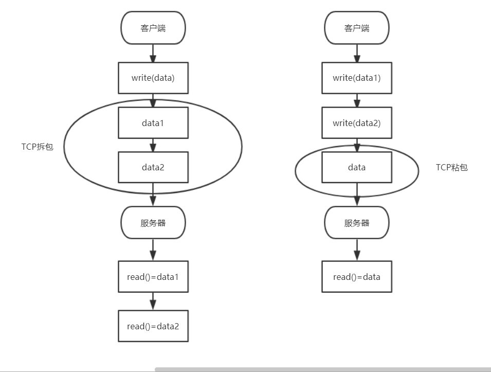

## 什么是 TCP 粘包/拆包
在 TCP 传输数据的时候，没有边界的，
它会根据 TCP 缓冲区的实际情况来进行包的划分，在发送数据时，TCP 底层可能会把一个数据包拆分成几个小包来发送，也可能把几个数据包封装成一个大包来发送。这样讲可能不够形象，下面用图来说明一下

2.1 TCP 拆包

通过图片左边的流程图可以看到，当客户端想要发送一条 data 业务数据时，服务器读到了两条数据，因为在传输过程中被拆成了两个包，此时如果不对 TCP 拆包做处理的话，就不能正确的拿到客户端发送过来的业务数据。

2.2 TCP 粘包

通过图片右边的流程图可以看到，客户端发送了 data1 和 data2 两条业务数据，但是在传输过程中被粘包成了一个 data 数据，服务器拿到之后并不能还原回之前的两条业务数据，这就是所谓的 TCP 粘包。

接下来就以上一节课的例子来复现 TCP 粘包和拆包的问题。
## netty 解决拆包和粘包问题
netty通过定义解码去来解决拆包和粘包问题，一下列举几类常用的解码器

```markdown
DelimiterBasedFrameDecoder： 这个类可以自定义分割符来作为业务数据分割的标识，比如定义以$做分割，就可以这样写：

//添加以$做分隔符的解码器
channel.pipeline().addLast(new DelimiterBasedFrameDecoder(1024, Unpooled.wrappedBuffer("$".getBytes())));
copy
//写数据时以$结尾
response.writeBytes((result + "$").getBytes());
copy

FixedLengthFrameDecoder: 这个类是使用固定长度来分割业务数据，在该类的构造函数中指定好业务数据的长度，比如之前测试的666+666，这个数据的长度就是固定的，就可以利用 FixedLengthFrameDecoder 来指定数据长度，让 netty 做对应的数据解码：

//666+666的字节长度为7
channel.pipeline().addLast(new FixedLengthFrameDecoder(7));
copy
这样在服务器设置了 FixedLengthFrameDecoder 之后，就能正常接收客户端发送过来的业务数据了。

LineBasedFrameDecoder:这个类是用换行符来作为业务数据分割的标识的
//使用换行符来分割业务数据
channel.pipeline().addLast(new LineBasedFrameDecoder(1024));
```

## 自定义编解码器
通过上一节知道，使用channel.pipeline().addLast()方法来添加一个编解码器，现在就来讲一下 pipeline 内部构造，以方便理解 netty 的编解码器概念，通过下图来看看piepeline内部的构造：


- 详细例子看代码 example1
