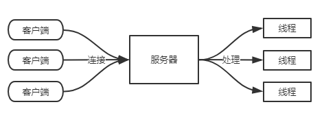

## 什么是io

-- I/O 指的是输入输出，通常指数据在内部存储器和外部存储器或其他周边设备之间的输入和输出。简而言之，从硬盘中读写数据或者从网络上收发数据，都属于 I/O 行为。

Linux 系统将所有的外部设备都看作一个文件来看待，所有打开的文件都通过文件描述符(简称 fd)来引用。而对一个 socket 的读写也会有相应的描述符，称为 socket 描述符(简称 socketfd)。描述符是一个非负整数，它指向内核中的一个结构体，由系统内核返回给进程。

在 Linux 内核中，I/O 操作通常包含两个阶段：

- 1. 内核等待数据准备好
- 2. 从内核复制数据到进程中

根据在这两个阶段的不同处理，Linux 提供了以下 5 种不同的 I/O 模型：

- 阻塞 I/O 模型
- 非阻塞 I/O 模型
- I/O 复用模型
- 信号驱动式 I/O 模型
- 异步 I/O 模型(以linux为例：异步 I/O 的机制是告知内核启动某个操作，由内核来完成操作(包括把内核数据复制到进程缓冲区)，应用进程只需要等待内核通知操作完成即可，示意图如下)

## 传统io（bio）

在 JDK1.4 之前，JAVA 只存在一种 I/O 类库，就是 BIO，这是最好理解的 I/O 模型（对应阻塞 I/O 模型）。在 BIO 模型下，由于 I/O 操作都是阻塞的，所以每个客户端连接都会在服务器中用一个单独的线程做处理，示意图如下：

## NIO

NIO 编程是在 JDK1.4 之后引入的，NIO 相对于之前的 I/O 库是新增的，所以官方称它为 New I/O，NIO 对应 I/O 复用模型，来简单回顾下上节实验内容：

> I/O 复用模型：Linux 提供 select、poll,进程可以通过将 fd 传递给 select 或 poll 系统调用，阻塞 select 操作，这样 select、poll 就可以监听多个 fd 是否处于就绪状态。

对此在 JAVA NIO 中引进了一个 `Selector` 的类，负责注册和分发 I/O 事件，一般称之为多路复用器，另外还提供了`Buffer`和`Channel`两个类来配合使用，下面就来简单了解下 JAVA NIO 相关的概念和功能。

### Buffer

Buffer 从名字就可以看出来是缓冲的意思，它支持写入和读取数据,与传统 BIO 不同，BIO 是面向流的 I/O，对数据的读写都是直接通过流(Stream)进行。而在 NIO 中所有数据的读写都是通过缓冲区(Buffer)进行。

JDK 提供了非常多的 Buffer 类型，具体如下：

- ByteBuffer
- CharBuffer
- ShortBuffer
- IntBuffer
- LongBuffer
- FloatBuffer
- DoubleBuffer

可以看到 JAVA 的基本类型除了 boolean ，都有与之对应的 Buffer 类。在网络编程中用到最多的就是 ByteBuffer。

### Channel

Channel 是一个管道，有点类似于传统 BIO 中的流，但是流只能支持一个方向的数据传输(读或者写)，而 Channel 同时支持读和写，Channel 可以分为两大类，一类是用于网络读写的`SelectableChannel`，另一类是用于文件读写的`FileChannel`。在接下来的 NIO 编程中使用到的就是`SelectableChannel`的子类`ServerSocketChannel`和`SocketChannel`。

### Selector

前面说了 Selector 是一个负责 I/O 事件的注册、分发组件，把多个 Channel 的 I/O 事件都注册在 Selector 上，通过 Selector 来分发，这样就可以用一个 Selector 同时处理多个 Channel，这样的话就可以在一个线程上处理成千上万个客户端的 I/O 事件。

## AIO 编程

在 JDK1.7 中引入了 NIO2.0 类库，也就是对应这节要学习的 AIO 编程，意味着 JAVA 开始支持真正的异步 I/O 模型，AIO 就对应着 异步 I/O 模型，来简单回顾下：

> 异步 I/O 模型：异步 I/O 的机制是告知内核启动某个操作，然后由内核来完成操作(包括把内核数据复制到进程数据)，应用进程只需要等待内核通知操作完成即可

在之前 NIO 编程中，其实不算真正的异步，因为在`Selector.select()`方法的执行时，还是会阻塞住.在 AIO 中就不存在`Selecotr`了，由内核直接通知给进程应用，通过回调的方式来编写。

## 补充知识

* mvn 启动java方法命令

  mvn exec:java -Dexec.mainClass="com.shiyanlou.bio.TimeServer"

* mvn 初始化项目

  mvn archetype:generate -DgroupId=com.shiyanlou -DartifactId=netty-hello2 -Dversion=1.0-SNAPSHOT -DarchetypeArtifactId=maven-archetype-quickstart -DarchetypeCatalog=internal

