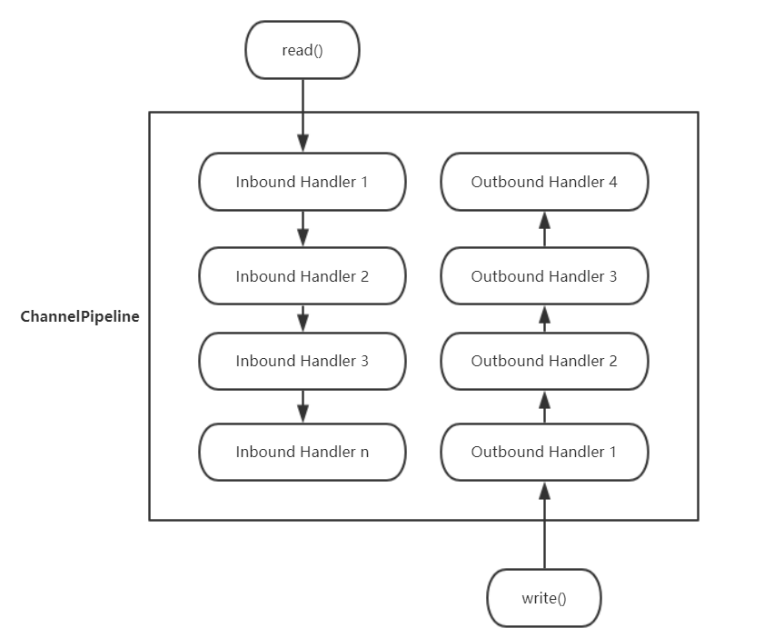
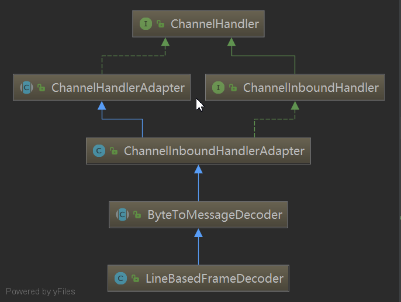
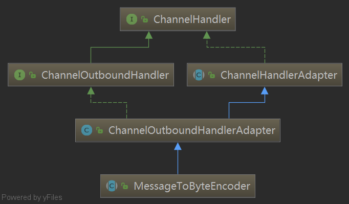

# 自定义netty中的编解码器
## 解码器
使用channel.pipeline().addLast()方法来添加一个编解码器，现在就来讲一下 pipeline 内部构造，
以方便理解 netty 的编解码器概念，通过下图来看看piepeline内部的构造：

在 netty 中会为每个channel构造一个默认的pipeline对象，数据输入输出就像流水一样，通过pipeline里的 handler 列表对输入和输出做处理，在读到数据时会通过pipeline的Inbound Handler列表，
每通过一个Handler数据可能都会进行处理，再传递到下一个Handler。
同理，输出数据也会经过pipeline的Outbound Handler列表，netty 中所有的handler对象都是ChannelHandler接口的父类。


netty 提供了ChannelInboundHandler接口用于处理数据的输入，看看之前使用的LineBasedFrameDecoder的类关系图：

可以看到LineBasedFrameDecoder继承ByteToMessageDecoder,该类是 netty 抽象出来的一个解码器类，通过继承该类并重写decode方法，就能实现将接收到的字节数据解析为业务数据对象，该方法声明如下：

```java
protected abstract void decode(ChannelHandlerContext ctx, ByteBuf in, List<Object> out) throws Exception;
```
读到了 ByteBuf 之后，进行相应的解码处理，将转码后的对象加入到List<Object> out列表里，之后就会向下一个ChannelInboundHandler传递，理解了这个概念之后就来着手改造服务器，目标是通过自定义一个解码器，将 ByteBuf 转成计算需要的对象，这里使用一个请求头+请求体的模式来对消息格式进行定义，请求头由 4 个字节组成存放请求体的字节长度，请求体则为业务正式传输的数据： head | --- 4 byte --- | body | --- ... --- |

固定前四位作为请求体的长度，之后只要读取对应长度的字节集就能获取正确的请求体了，熟悉 http 协议的同学看到是不是觉得和Content-Length很像，其实 http 协议在非 Chunked 编码下就是通过Content-Length来确定响应体的报文长度的，这里就简单的模拟下。

首先在com.shiyanlou.server.handler包下新建一个类CalcBean.java,代码如下：
```java
package com.shiyanlou.server.handler;

public class CalcBean {

  //数字一
  private int num1;
  //数字二
  private int num2;
  //运算符号
  private String symbol;

  public int getNum1() {
    return num1;
  }

  public void setNum1(int num1) {
    this.num1 = num1;
  }

  public int getNum2() {
    return num2;
  }

  public void setNum2(int num2) {
    this.num2 = num2;
  }

  public String getSymbol() {
    return symbol;
  }

  public void setSymbol(String symbol) {
    this.symbol = symbol;
  }

  @Override
  public String toString() {
    return num1 + " " + symbol + " " + num2;
  }
}
```
接着在com.shiyanlou.server.handler包下创建CalcDecoder.java类作为自定义解码器类，代码如下：
```java
package com.shiyanlou.server.handler;

import io.netty.buffer.ByteBuf;
import io.netty.channel.ChannelHandlerContext;
import io.netty.handler.codec.ByteToMessageDecoder;

import java.util.List;
import java.util.regex.Matcher;
import java.util.regex.Pattern;

public class CalcDecoder extends ByteToMessageDecoder {

  @Override
  protected void decode(ChannelHandlerContext ctx, ByteBuf in, List<Object> out) throws Exception {
    //读取请求头，定义的是4个字节，不够的话直接返回等待下一次报文
    if (in.readableBytes() < 4) {
      return;
    }
    //readInt()方法就是读取4个byte并转成int
    int contentLength = in.readInt();
    //如果剩余可读的字节数比请求体长度小，还原ByteBuf下标等待下一次请求报文
    if (in.readableBytes() < contentLength) {
      in.readerIndex(in.readerIndex() - 4);
      return;
    }
    //读取请求体
    byte[] content = new byte[contentLength];
    in.readBytes(content);
    //使用正则进行匹配,解析请求体并转换成对象
    Pattern pattern = Pattern.compile("^(\\d+)([+\\-*/])(\\d+)$");
    Matcher matcher = pattern.matcher(new String(content));
    if (matcher.find()) {
      int num1 = Integer.valueOf(matcher.group(1));
      String symbol = matcher.group(2);
      int num2 = Integer.valueOf(matcher.group(3));
      CalcBean calcBean = new CalcBean();
      calcBean.setNum1(num1);
      calcBean.setNum2(num2);
      calcBean.setSymbol(symbol);
      System.out.println("接收到请求体：" + calcBean.toString());
      out.add(calcBean);
    }
  }
}
```
这里要注意一点是在decode()方法中，如果ByteBuf未读完，在下一次请求报文过来时，netty 会自动处理ByteBuf，读下标(readerIndex)还是接着上一次请求的下标，而不是默认将ByteBuf读完。

接着将自定义的解码器加入到pipeline里：

CalcServer.java 中解码代码修改如下(注意引入对应的类)：
```java
// 引入类
import com.shiyanlou.server.handler.CalcDecoder;
```
```java
protected void initChannel(Channel channel) throws Exception {

  //使用自定义解码器将报文解码成业务对象
  channel.pipeline().addLast(new CalcDecoder());
  //自定义计算器handler类
  channel.pipeline().addLast(new CalcServerHandler());
}
```
解码后的CalcBean对象就会传递到CalcServerHandler里，再进行对应的计算处理：

com/shiyanlou/server/handler 包中 CalcServerHandler.java 修改如下
```java
package com.shiyanlou.server.handler;

import io.netty.buffer.ByteBuf;
import io.netty.buffer.Unpooled;
import io.netty.channel.ChannelHandlerContext;
import io.netty.channel.ChannelInboundHandlerAdapter;

public class CalcServerHandler extends ChannelInboundHandlerAdapter {

  @Override
  public void channelActive(ChannelHandlerContext ctx) throws Exception {
    System.out.println("有新的客户端连接至服务器");
  }

  @Override
  public void channelRead(ChannelHandlerContext ctx, Object msg) throws Exception {
    //拿到上一个handle返回的对象
    CalcBean calcBean = (CalcBean) msg;
    double result = 0;
    double num1 = calcBean.getNum1();
    double num2 = calcBean.getNum2();
    //分配一个ByteBuf对象
    ByteBuf response = Unpooled.buffer();
    //根据符号进行相应的计算
    switch (calcBean.getSymbol()) {
      case "+":
        result = num1 + num2;
        break;
      case "-":
        result = num1 - num2;
        break;
      case "*":
        result = num1 * num2;
        break;
      case "/":
        result = num1 / num2;
        break;
    }
    //将计算结果写入到ByteBuf中
    response.writeBytes((result + System.lineSeparator()).getBytes());
    //把消息返回到客户端
    ctx.writeAndFlush(response);
  }
}
```
至此就完成了对服务器代码的改造，通过自定义解码器把业务处理和解码分离了出来，接下来再通过自定义编码器来改造客户端代码。
## 编码器
和解码器相反的是，编码器是将业务对象编码成ByteBuf对象，最终通过 netty 把数据写出去，同样的 netty 提供了一个MessageToByteEncoder类用于处理
编码，类关系图如下：

MessageToByteEncoder通过实现ChannelOutboundHandler接口来处理数据的写操作，这里只需要继承MessageToByteEncoder并重写encode()方法就能实现将对象转换为 ByteBuf 数据功能，下面来看看用代码怎么实现。
在com.shiyanlou.client.handler包下新建CalcEncoder.java类，代码如下：
```java
package com.shiyanlou.client.handler;

import com.shiyanlou.server.handler.CalcBean;
import io.netty.buffer.ByteBuf;
import io.netty.channel.ChannelHandlerContext;
import io.netty.handler.codec.MessageToByteEncoder;

public class CalcEncoder extends MessageToByteEncoder<CalcBean> {

  @Override
  protected void encode(ChannelHandlerContext ctx, CalcBean msg, ByteBuf out) throws Exception {
    //将对象转换成字节传输
    byte[] content = (msg.getNum1() + msg.getSymbol() + msg.getNum2()).getBytes();
    //输出请求头，writeInt()是写4个byte
    out.writeInt(content.length);
    //输出请求体
    out.writeBytes(content);
  }
}
```
将编码之后的请求数据写入到ByteBuf对象中，netty 会在调用完此方法后输出该ByteBuf。

接着把CalcEncoder添加到客户端的pipeline中，CalcClient.java 中编码部分修改如下(注意引入对应的类)
```java
// 引入类
import com.shiyanlou.client.handler.CalcEncoder;

protected void initChannel(Channel channel) throws Exception {
  //添加自定义编码器用于CalcBean对象的编码
  channel.pipeline().addLast(new CalcEncoder());
  channel.pipeline().addLast(new CalcClientHandler());
}
```
在CalcClientHandler中只需要负责将CalcBean对象输出即可，不需要关心数据是怎么编码的，代码如下：
```java
package com.shiyanlou.client.handler;

import com.shiyanlou.server.handler.CalcBean;
import io.netty.buffer.ByteBuf;
import io.netty.buffer.Unpooled;
import io.netty.channel.ChannelHandlerContext;
import io.netty.channel.ChannelInboundHandlerAdapter;
import java.util.Scanner;

public class CalcClientHandler extends ChannelInboundHandlerAdapter {

  //连接服务器成功时的回调方法
  @Override
  public void channelActive(ChannelHandlerContext ctx) throws Exception {
    CalcBean calcBean = new CalcBean();
    //提示客户端输入待计算的数字和符号
    System.out.print("请输入第一个数字：");
    Scanner scanner = new Scanner(System.in);
    calcBean.setNum1(scanner.nextInt());
    System.out.print("请输入计算符号：");
    calcBean.setSymbol(scanner.next());
    System.out.print("请输入第二个数字：");
    calcBean.setNum2(scanner.nextInt());
    //将对象直接输出，通过自定义编码器处理对应的编码逻辑
    ctx.writeAndFlush(calcBean);
  }

  @Override
  public void channelRead(ChannelHandlerContext ctx, Object msg) throws Exception {
    //拿到服务器传来的消息
    ByteBuf byteBuf = (ByteBuf) msg;
    //根据读到的消息长度创建字节数组
    byte[] data = new byte[byteBuf.readableBytes()];
    //把消息读到字节数组中
    byteBuf.readBytes(data);
    //将读到的消息转成字符串
    String body = new String(data, "utf-8");
    System.out.println("接收到计算结果：" + body);
    System.out.print("是否需要继续计算(Y/N)：");
    String flag = new Scanner(System.in).next();
    //判断是否要继续计算
    if ("Y".equalsIgnoreCase(flag)) {
      channelActive(ctx);
    } else {
      System.out.println("客户端关闭中...");
      //关闭客户端
      ctx.close();
    }
  }
}
```
